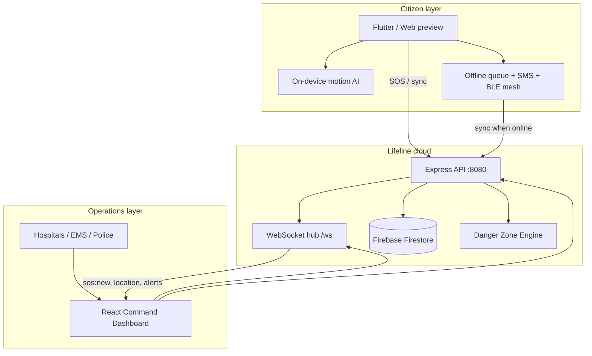
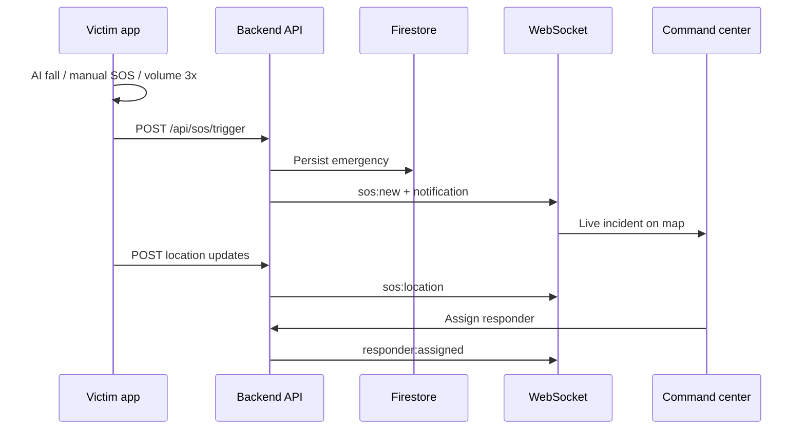
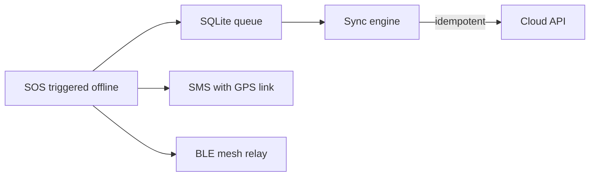
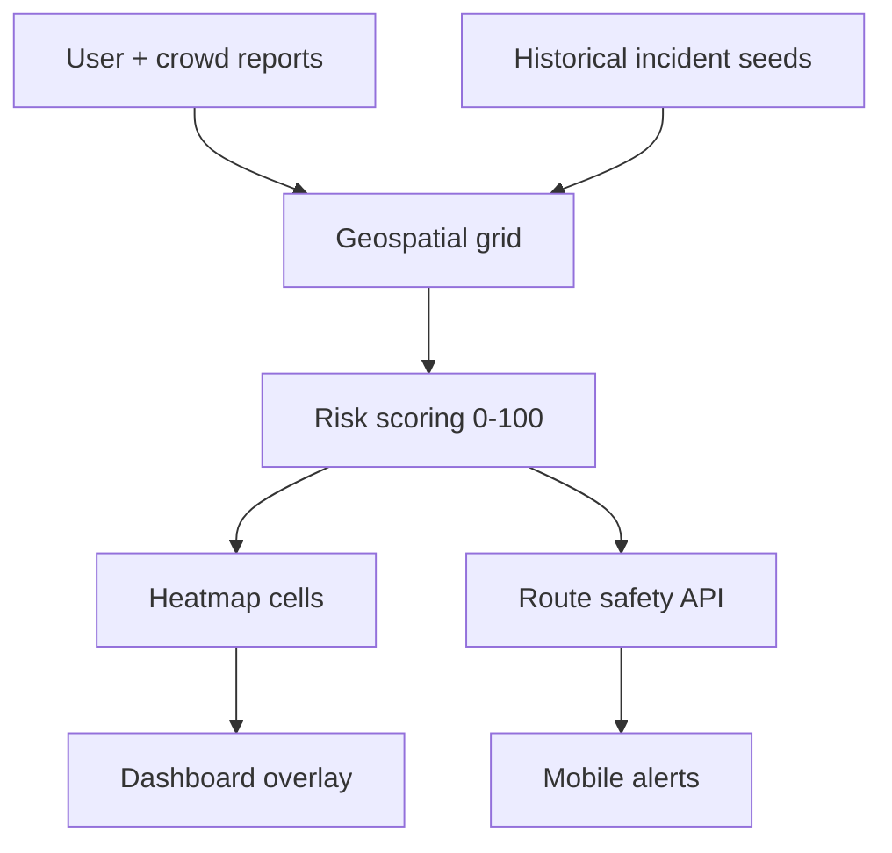
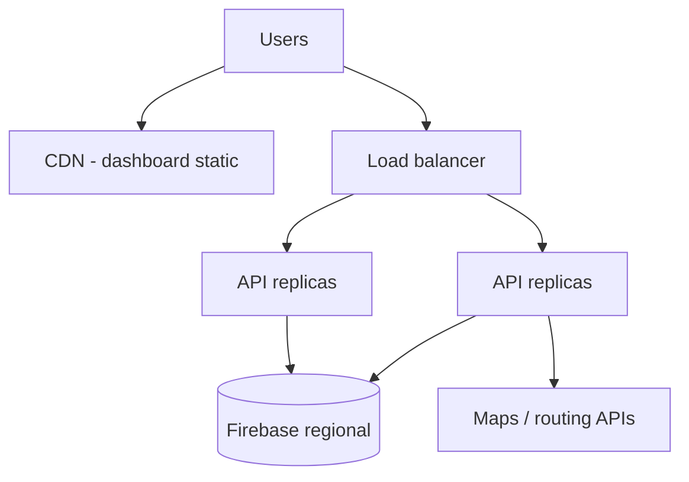

# System Architecture

## High-level platform

```mermaid
flowchart TB
  subgraph Citizen["Citizen layer"]
    APP[Flutter / Web preview]
    EDGE[On-device motion AI]
    OFF[Offline queue + SMS + BLE mesh]
    APP --> EDGE
    APP --> OFF
  end

  subgraph Cloud["Lifeline cloud"]
    API[Express API :8080]
    WS[WebSocket hub /ws]
    FB[(Firebase Firestore)]
    AI[Danger Zone Engine]
    API --> FB
    API --> WS
    API --> AI
  end

  subgraph Ops["Operations layer"]
    DASH[React Command Dashboard]
    EMS[Hospitals / EMS / Police]
    DASH --> WS
    DASH --> API
    EMS --> DASH
  end

  APP -->|SOS / sync| API
  OFF -->|sync when online| API
  WS -->|sos:new, location, alerts| DASH
```

## SOS trigger flow

```mermaid
sequenceDiagram
  participant V as Victim app
  participant API as Backend API
  participant DB as Firestore
  participant WS as WebSocket
  participant C as Command center

  V->>V: AI fall / manual SOS / volume 3x
  V->>API: POST /api/sos/trigger
  API->>DB: Persist emergency
  API->>WS: sos:new + notification
  WS->>C: Live incident on map
  V->>API: POST location updates
  API->>WS: sos:location
  C->>API: Assign responder
  API->>WS: responder:assigned
```

## Offline-first path

```mermaid
flowchart LR
  SOS[SOS triggered offline]
  Q[SQLite queue]
  SMS[SMS with GPS link]
  MESH[BLE mesh relay]
  SYNC[Sync engine]
  CLOUD[Cloud API]

  SOS --> Q
  SOS --> SMS
  SOS --> MESH
  Q --> SYNC
  SYNC -->|idempotent| CLOUD
```

## Danger Zone AI

```mermaid
flowchart TB
  R[User + crowd reports]
  H[Historical incident seeds]
  G[Geospatial grid]
  SC[Risk scoring 0-100]
  HM[Heatmap cells]
  RT[Route safety API]

  R --> G
  H --> G
  G --> SC
  SC --> HM
  SC --> RT
  RT --> APP[Mobile alerts]
  HM --> DASH[Dashboard overlay]
```

## Deployment topology (production target)

```mermaid
flowchart TB
  CDN[CDN - dashboard static]
  LB[Load balancer]
  API1[API replicas]
  API2[API replicas]
  FB[(Firebase regional)]
  MAPS[Maps / routing APIs]

  Users --> CDN
  Users --> LB
  LB --> API1
  LB --> API2
  API1 --> FB
  API2 --> FB
  API1 --> MAPS
```
