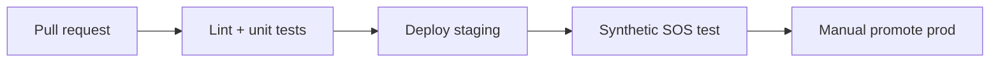

# Deployment Strategy

## Hackathon / demo (today)

```powershell
cd backend && npm run dev          # :8080
cd dashboard && npm run dev        # :5173
npx serve preview -l 3000
npx serve home -l 4000
# Optional: npx serve hackathon -l 5000
```

- Dashboard key: `lifeline-dashboard-dev`
- Demo API: `POST /api/demo/hackathon-run` (with dashboard header)
- Seed: `npm run seed:responders`, `npm run seed:safety`

## Staging (pilot)

| Component | Target |
|-----------|--------|
| API | Railway / Render / Cloud Run |
| Dashboard | Vercel / Firebase Hosting |
| Mobile | TestFlight + Play Internal |
| Firebase | Staging project, rules enforced |
| Maps | Restricted API keys per env |

Environment variables:
- `DASHBOARD_API_KEY`, `GOOGLE_MAPS_KEY`, Firebase service account
- `VITE_API_BASE`, `VITE_DASHBOARD_KEY`, `VITE_GOOGLE_MAPS_API_KEY`

## Production (national)

1. **Security:** Rotate keys, WAF, rate limits, audit logs
2. **Compliance:** GDPR/DPA, data residency, EMS data-sharing agreements
3. **Integrations:** CAD/999 webhooks, hospital HL7/FHIR where available
4. **SRE:** 99.9% API target, on-call, synthetic SOS probes every 5 min
5. **DR:** Firestore backups, multi-region failover for API

## CI/CD pipeline (recommended)



## Mobile release
- `flutterfire configure` for production Firebase
- Play/App Store: emergency app fast-track where applicable
- OTA config for danger zone thresholds without store delay
